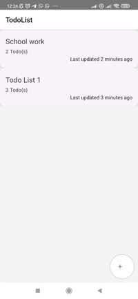

# Todo List App

## Description

Todo list app is a mobile application for you to create your own todo list. You can access the list anywhere on your mobile, as long as you have internet connection.

## Status

The project is currently still under development. However, you can access the backend API at the link below.

Backend API: https://todo.dlau.one/api/

Remaining features to implement:
1. Create, update and delete on mobile application
2. Integrate persist into redux (for offline)
3. User authentication (possible)

## Setup guides

Backend: [Setup Guide](./todo-backend/README.MD)

Mobile application: [Setup Guide](./todo_app/README.MD)

## Screenshots

### Todo List Page (Page to see all todo lists)

### Todo List Todos Page (Page to see all todos in todo lists)

