# Screenshots

## Todo List

### Todo List Page (Page to see all todo lists)
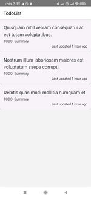

### Create Todo List
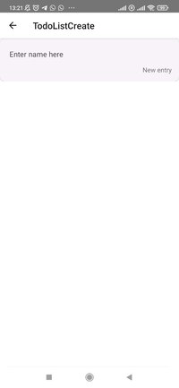
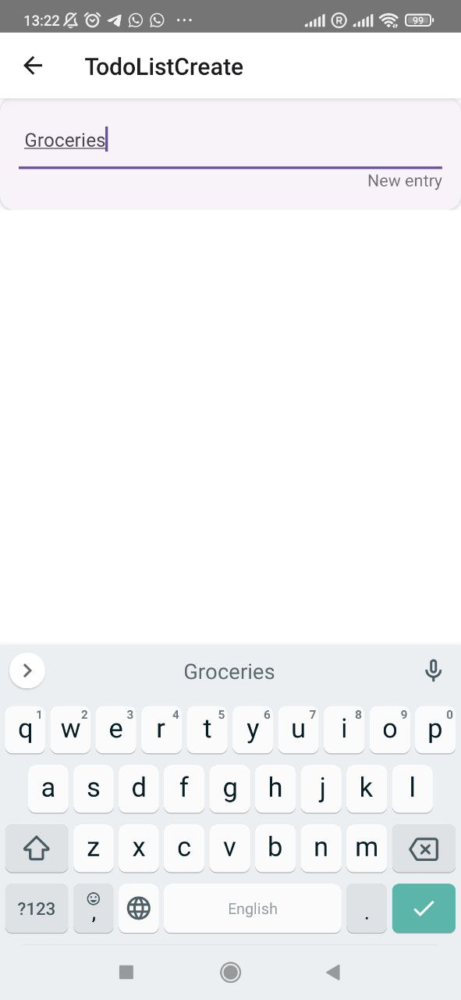
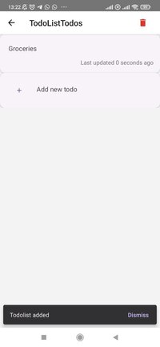

### Update Todo List
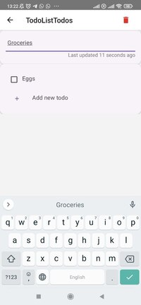
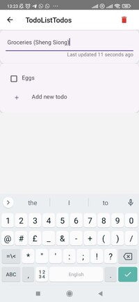
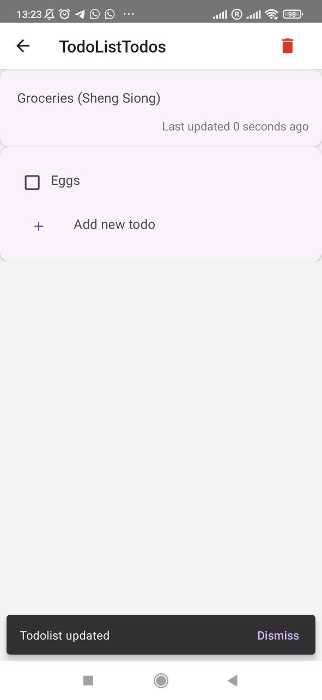

### Delete Todo List
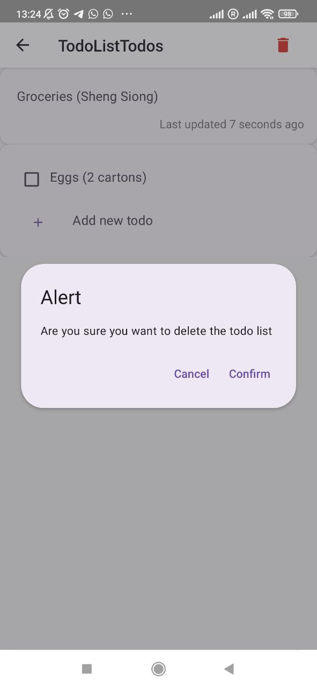
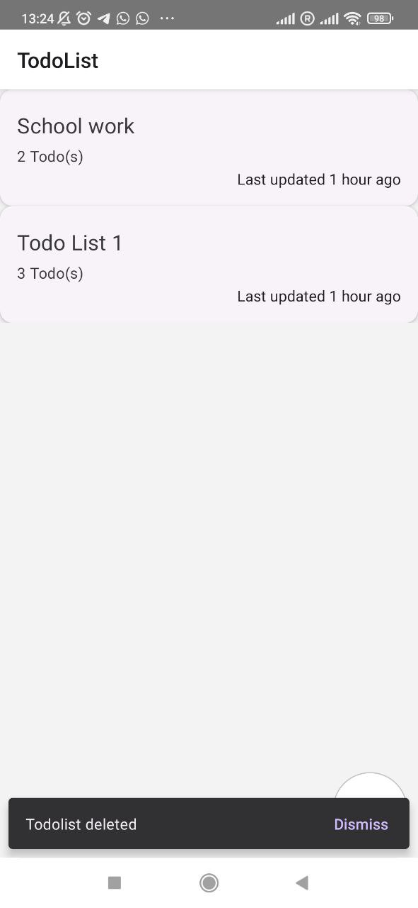

## Todo List's Todos

### Todo List Todos Page (Page to see all todos in todo lists)
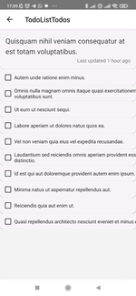

### Add Todo to Todo List
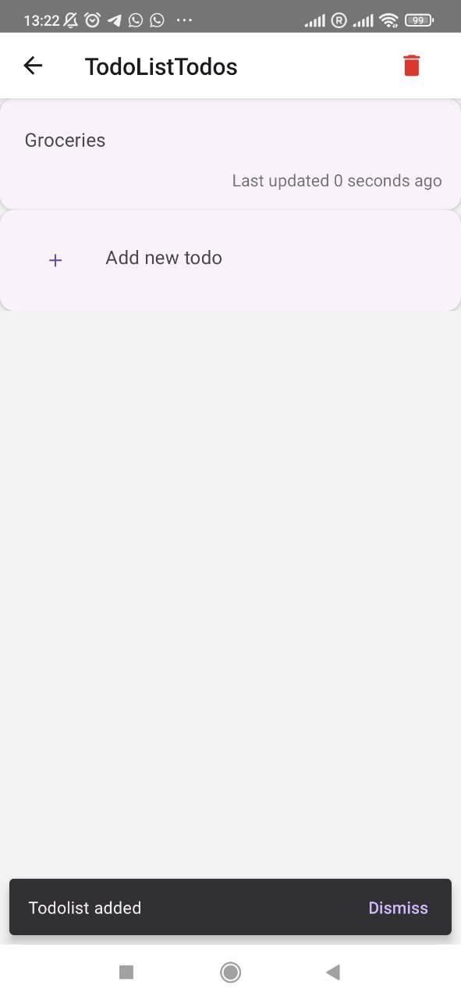
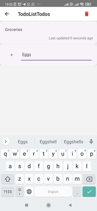
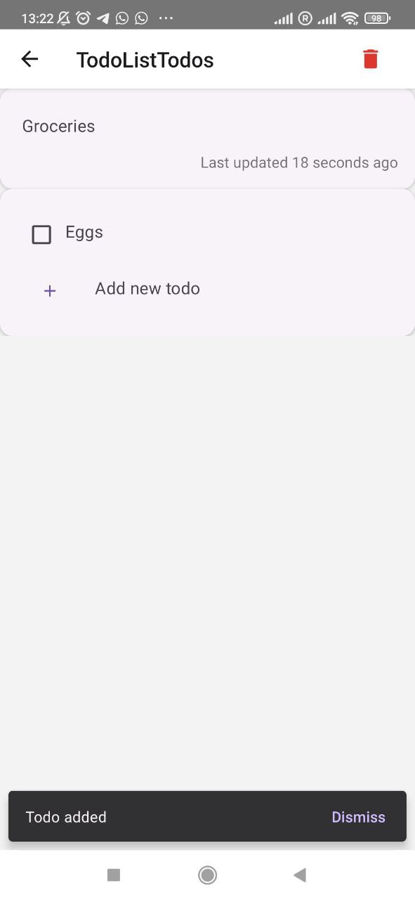

### Update Todo in Todo List
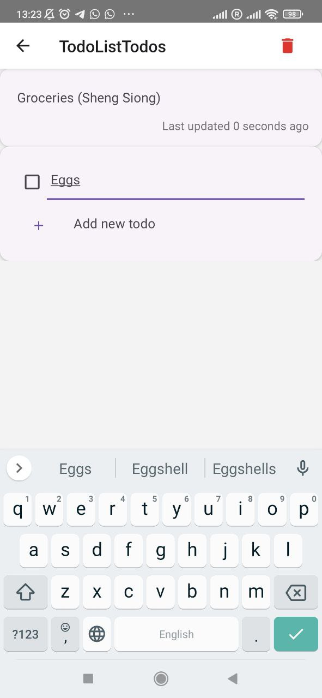
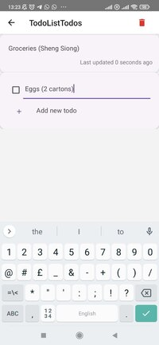
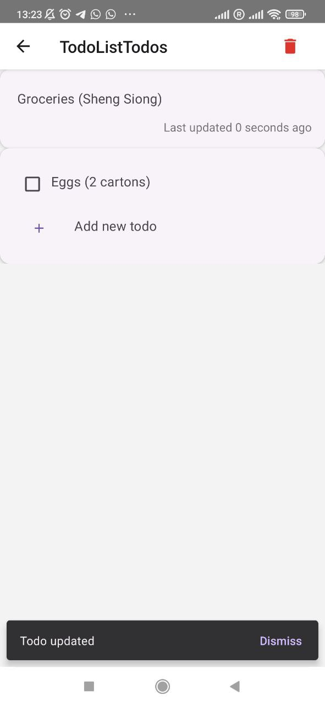

### Delete Todo from Todo List
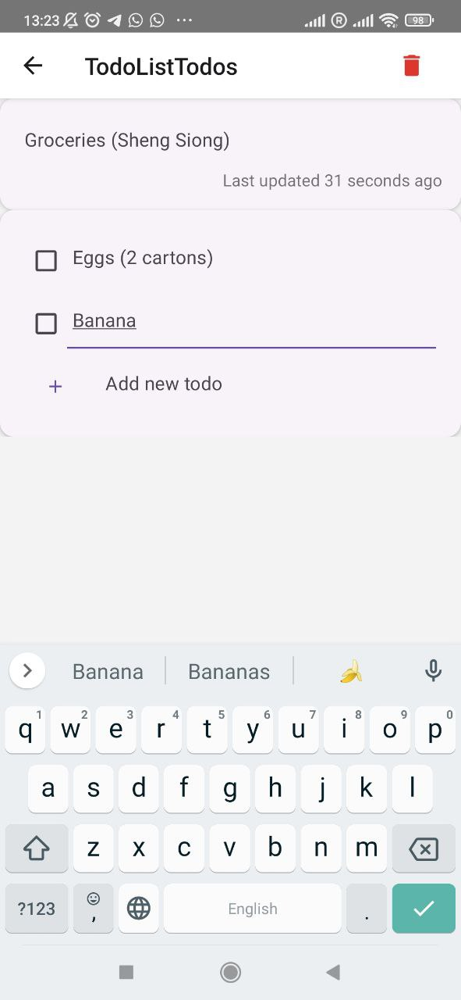
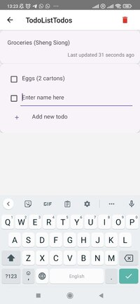

## Offline Pages

### Todo List Page
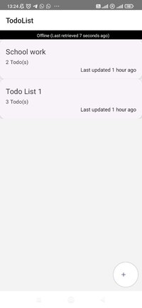

### Todo List's Todos Page
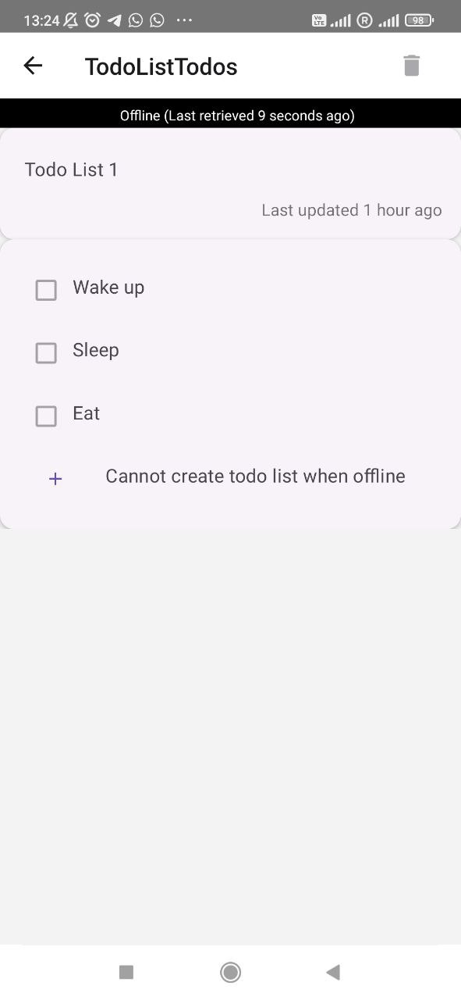

