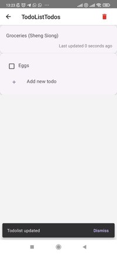
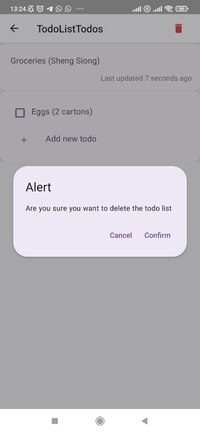
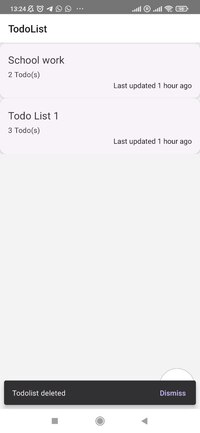
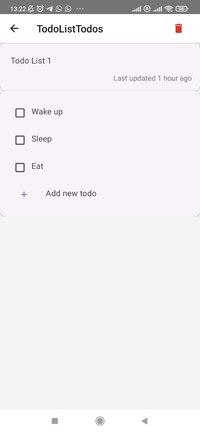
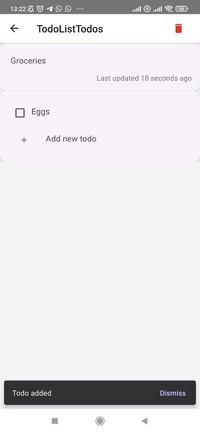
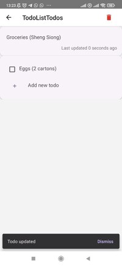
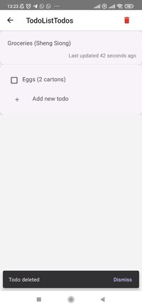
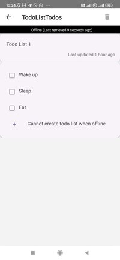

# Screenshots

## Todo List

### Todo List Page (Page to see all todo lists)

### Create Todo List

### Update Todo List

### Delete Todo List

## Todo List's Todos

### Todo List Todos Page (Page to see all todos in todo lists)

### Add Todo to Todo List

### Update Todo in Todo List

### Delete Todo from Todo List

## Offline Pages

### Todo List Page

### Todo List's Todos Page

